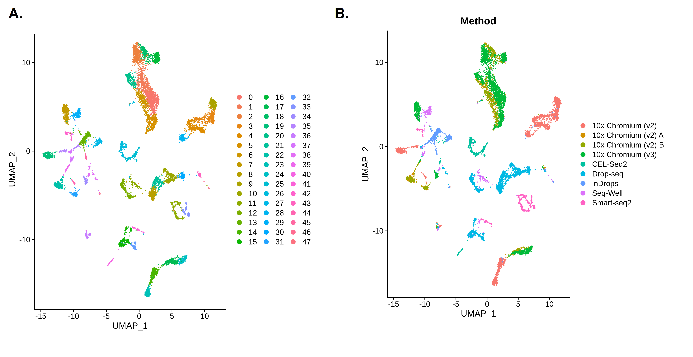
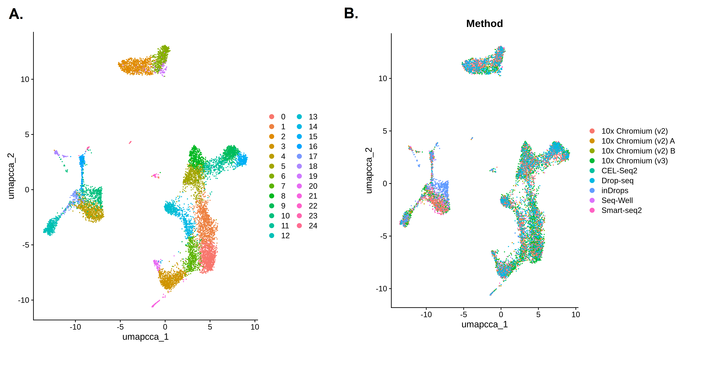

# Introduction

Single cell analyses can be complex. We might have data from different experimental batches, perhaps because we ran our experiments at different times, in different labs, or using different sequencing platforms. Sometimes we might want to combine multiple datasets, for example if we want to compare our own experimental data to a similar public dataset. 

If we simply run these different batches or combined datasets through a clustering pipeline such as Scanpy or Seurat, we might not get useful results. Clustering prioritises the genes that show the biggest differences in expression and uses these to identify groups of cells that share similar expression patterns. When we have different experimental batches or have combined multiple studies, these big differences might relate more to the differences between batches or datasets than to the biological differences we're interested in, such as cell type. Our clusters could therefore end up representing different batches or datasets, rather than anything more useful.

In order to look beyond these technical differences, we can perform batch correction or integration. Both the Scanpy and Seurat pipelines include tools that can be used to correct for differences between experimental batches or to integrate datasets - we actually use the same tools to do both. In this tutorial, we will learn how to use these tools in either the Scanpy or Seurat pipeline - you can choose which one you would like to use.

> <comment-title></comment-title>
>
> This tutorial is based on the [Introduction to scRNE-seq integration](https://satijalab.org/seurat/articles/integration_introduction) and [Integrative analysis in Seurat v5](https://satijalab.org/seurat/articles/seurat5_integration) tutorials.
>
{: .comment}


> <agenda-title></agenda-title>
>
> In this tutorial, we will cover:
>
> 1. TOC
> {:toc}
>
{: .agenda}

# Important tips for easier analysis







# Scanpy or Seurat?

Scanpy and Seurat are two of the most commonly used pipelines (sets of tools) for analysing single cell data. Both pipelines have all the tools required to perform clustering, which identifies groups of cells that share similar expression profiles. Clustering is often the first step in single cell analysis because it makes our data easier to interpret. Clusters represent groups of cells that are expressing the same genes, which often correspond to specific cell types or states. Our goal is to identify biologically relevant clusters that will help us to better understand our data.

The Scanpy and Seurat pipelines include tools for preprocessing single cell data, performing dimensional reductions such as PCA, constructing a neighbourhood graph and finding clusters in it. Although both pipelines perform the same basic steps, there are some differences in how these steps are performed that mean you can end up with slightly different results depending on which pipeline you choose. However, your results should be broadly the same, no matter which pipeline you use.

The main difference between these two pipelines is that Scanpy is written for Python while Seurat is written for R. If we were working in a Python or R environment, then we would need to choose the appropriate pipeline. However, since we're working on Galaxy, we're free to choose either set of tools.

## Get data



<div class='Scanpy' markdown='1'>

SCANPY GET DATA

</div>

<div class='Seurat' markdown='1'>

> <hands-on-title> Data Upload </hands-on-title>
>
> 1. Create a new history for this tutorial
>
> 2. Import the files from [Zenodo]({{ page.zenodo_link }})
>
>    ```
>   https://zenodo.org/records/14734574/files/Input_SeuratObject.rds
>    ```
>
>    
>
>    
>
> 3. Check that the datatype is `rds`
>
>    
>
{: .hands_on}

</div>

You should now have either an AnnData or SeuratObject dataset in your history. Both datasets contain the same information, but in the different formats required by the Scanpy and Seurat pipelines.

We are using a single cell dataset of human Peripheral Blood Mononuclear Cells (PBMCs) that was also used in Seurat's [Integrative analysis in Seurat v5](https://satijalab.org/seurat/articles/seurat5_integration) tutorial. The original study compared the results from seven different single cell and single nuclear techniques .

Let's take a look at our data before we begin the analysis to see whether we might need to perform batch correction or integration.

<div class='Scanpy' markdown='1'>

SCANPY INSPECT

</div>

<div class='Seurat' markdown='1'>

> <hands-on-title> Task description </hands-on-title>
>
> 1.  with the following parameters:
>    - *"Method used"*: `Inspect Seurat Object`
>        - *"Display information about"*: `General`
>
{: .hands_on}

> <question-title></question-title>
>
> 1. How many cells and genes are in this dataset?
> 2. How many layers are in this dataset?
>
> > <solution-title></solution-title>
> >
> > 1. If we click on the  of the new output in our history, we can see that this dataset contains information about the expression of 33,694 features (genes) in 10,434 samples (cells).
> > 2. Data in SeuratObjects are stored in layers. In this case, we only have one layer called `counts`. The `counts` layer is the raw data that we'll be using in this tutorial.
> >
> {: .solution}
>
{: .question}

> <hands-on-title> Task description </hands-on-title>
>
> 1.  with the following parameters:
>    - *"Method used"*: `Inspect Seurat Object`
>        - *"Display information about"*: `Cell Metadata`
>
{: .hands_on}

</div>

> <question-title></question-title>
>
> 1. What does the `Method` column represent in the cell metadata?
> 2. Do you think batch correction or integration is needed for this analysis?
>
> > <solution-title></solution-title>
> >
> > 1. The dataset that we're using comes from a study that compared different single cell techniques. The `Method` column tells us which technique was used on each cell.
> > 2. Each experimental technique can be considered as its own experimental batch. Each of these batches was processed independently, which by itself can be enough to require batch correction, even if the same experimental protocol is used - batches can vary simply because they were processed at different times or by different people in the same lab! In this case, we have an even stronger reason to believe that these batches will differ - we know that each batch was produced using a different technique, so it seems likely that we'll need to perform batch correction. We would consider this to be batch correction rather than integration because these data all came from the same original study.
> >
> {: .solution}
>
{: .question}

> <comment-title></comment-title>
>
> The cell metadata is any information about the cells that the original authors have included in the SeuratObject. As well as the cell barcode or identifier for each individual cell, the metadata will usually include information such as which donor or sample the cell came from or which experimental group it was in. Sometimes, this metadata will include lots of useful details such as demographic information about human donors that can help us to better understand our results. 
{: .comment}

# Batch Correction and Integration

We will often need to perform batch correction or integration during single cell analyses. If we are working with different experimental batches, donors, conditions, or datasets, then we need to look beyond the technical differences between them. Batch correction or integration can do this by matching cells of similar types of states across batches or datasets. Effectively, we are looking for cell subpopulations that are shared across the groups.

Scanpy and Seurat's integration tools will create a dimensional reduction that captures the shared sources of variation across the batches or datasets. The dimensional reduction can be used to find clusters or produce visualisations such as UMAP.

The terms batch correction and integration can be used somewhat interchangably, because they both refer to the same process of looking for shared cell subpopulations across groups. The same tools are used in the same way for both procedures, so you could use the workflow described in this tutorial to perform integration as well as batch correction.

The only difference is that we tend to talk about batch correction when we are working with groups produced in a single study (e.g. different experimental batches), while we would say integration when we're combining separate datasets from multiple studies.

# Clustering without Batch Correction

We suspect that batch correction will be needed because of the different technologies used to construct this dataset, but we'll try clustering without any correction first. This will confirm whether batch correction is truly needed on the basis of `Method`. Comparing the results we get now with those we'll get after batch correction should also help us to understand what batch correction is doing to our single cell data.

Since our focus is batch correction/integration, we won't go into too much detail on the clustering process. We just want to see how the integration steps fit into the main clustering pipeline and understand the impact it has on our data. If you aren't already familiar with this process, then you can learn more about clustering using the [Scanpy]() or [Seurat]() pipelines from the other single cell tutorials available on the GTN.

<div class='Scanpy' markdown='1'>

SCANPY CLUSTERING

</div>

<div class='Seurat' markdown='1'>

In the Seurat pipeline, we can use the ability of the SeuratObject to store multiple layers to split our data up before we begin the analysis. We might do this when we have different batches or if we've combined datasets. 

Splitting our data into layers means that the Seurat preprocessing tools can work on each layer separately. Each layer (in this case, each of our batches) will be normalised independently. We'll also identify the highly variable genes within each batch, rather than across the whole dataset. Seurat will then create a single consensus list of highly variable genes to use for the whole dataset.

The other tools in the Seurat pipeline, such as `RunPCA` and `FindClusters` will still work on the entire dataset.

Splitting the batches into separate layers could help to address some of the technical differences between them because of the separate preprocessing, but we'll have to wait for the results to see if this has been enough to eliminate these differences.

If you want to understand the impact of splitting and preprocessing the batches separately, then you could skip ahead to the next section, **Clustering with Seurat** and compare your results to those shown in this tutorial.

> <hands-on-title> Task description </hands-on-title>
>
> 1.  with the following parameters:
>    - *"Method used"*: `Split data into layers using 'split'`
>        - *"Factor or group to use to split data"*: `Method`
>
>    > <comment-title></comment-title>
>    >
>    > We are splitting our data on `Method` as this is the column in our metadata that represents our batches. Each of the methods listed in this column will be split into its own layer.
>    {: .comment}
>
{: .hands_on}

Let's take a look to see what we've done to our data.

> <hands-on-title> Task description </hands-on-title>
>
> 2.  with the following parameters:
>    -  *"Input file with the Seurat object"*: `rds_out` (output of **Seurat Integrate** )
>    - *"Method used"*: `Inspect Seurat Object`
>        - *"Display information about"*: `General`
>
{: .hands_on}

> <question-title></question-title>
>
> 1. How many layers do we now have in our dataset?
> 2. What do these layers represent?
>
> > <solution-title></solution-title>
> >
> > 1. We can see that there are now 9 layers in our SeuratObject. 
> > 2. We started out with one layer of raw data, called `counts`. That layer has now been split up according to `Method`. We now have nine `counts` layers. Each layer represents one of the batches named in the `Method` column of the cell metadata. We can see the names of the methods in the layer names. For example, the counts.Drop-seq layer contains the raw counts produced using the Drop-seq technique. Seven different methods were used in this study, but one of them was applied to three different batches - you should be able to see three layers with `Chromium_v2` in thier names.
> >
> {: .solution}
>
{: .question}

Now that we have split our data so that each batch is in its own layer, we will cluster it. We won't perform any batch correction, so we'll see if the differences in `Method` are causing any problems that might require correction.

We'll follow the default Seurat pipeline here, except that we'll use `30` PCs to build the neighborhood graph and cluster with a resolution of `2` as these were the parameters used in [the original Seurat version of this tutorial](https://satijalab.org/seurat/articles/seurat5_integration). We'll also give our clusters and UMAP more recognisable names as we'll be running these tools again later, after batch correction. 

> <comment-title></comment-title>
> Seurat has another option for preprocessing - rather than use the three separate functions presented below, you can use a single function called `SCTransform` to preform normalisation, identification of variable genes, and scaling all in one go. You will find this option on Galaxy's {% tool Seurat Preprocessing} tool.
>
> If you use `SCTransform` for preprocessing then you'll need to click the button to choose `Yes` for `Use SCT as Normalization Method` when you run `IntegrateLayers`. The `SCTransform` normalises the data in its own way, so we just need to let the tool know what to expect!
>
> The next step after identifying clusters would usually be to look for marker genes that are differentially expressed between clusters. If you perform integration/batch correction after using `SCTransform` then you will need to run the `PrepSCTFindMarkers` function before using tools such as `FindMarkers`. You'll find this in the  tool.
>
> The rest of the workflow will be the same as shown in this tutorial, but you will end up with different results because `SCTransform` handles preprocessing in a slightly different way than the three separate tools. If you want to learn more about these differences then you can choose the SCTransform route in the [Clustering 3k PBMCs with Seurat]() tutorial.
{: .comment}

> <hands-on-title> Task description </hands-on-title>
>
> 1.  with the following parameters:
>    -  *"Input file with the Seurat object"*: `rds_out` (output of **Seurat Integrate** )
>    - *"Method used"*: `Normalize with 'NormalizeData'`
>        - *"Method for normalization"*: `LogNormalize`
>
> 2.  with the following parameters:
>    -  *"Input file with the Seurat object"*: `rds_out` (output of **Seurat Preprocessing** )
>    - *"Method used"*: `Identify highly variable genes with 'FindVariableFeatures'`
>        - *"Method to select variable features"*: `vst`
>        - *"Output list of most variable features"*: `No`
>
> 3.  with the following parameters:
>    -  *"Input file with the Seurat object"*: `rds_out` (output of **Seurat Preprocessing** )
>    - *"Method used"*: `Scale and regress with 'ScaleData'`
>        - *"Regress out a variable"*: `No`
>        - *"Features to scale"*: `Variable Features`
>
> 4.  with the following parameters:
>    -  *"Input file with the Seurat object"*: `rds_out` (output of **Seurat Preprocessing** )
>    - *"Method used"*: `Run a PCA dimensionality reduction using 'RunPCA'`
>
>    > <comment-title> short description </comment-title>
>    >
>    > We will use the output from `RunPCA` in the  following section when we perform batch correction.
>    >
>    > If you're already very familiar with the Seurat clustering pipeline and you just want to try using the   tools, then you can skip ahead to the **Clustering after Integration** step now.
>    {: .comment}
>
> 5.  with the following parameters:
>    -  *"Input file with the Seurat object"*: `rds_out` (output of **Seurat Run Dimensional Reduction** )
>    - *"Method used"*: `Compute nearest neighbors with 'FindNeighbors'`
>        - *"Number of dimensions from reduction to use as input"*: `30`
>
> 6.  with the following parameters:
>    -  *"Input file with the Seurat object"*: `rds_out` (output of **Seurat Find Clusters** )
>    - *"Method used"*: `Identify cell clusters with 'FindClusters'`
>        - *"Resolution"*: `2.0`
>        - *"Algorithm for modularity optimization"*: `1. Original Louvain`
>        - *"Name for output clusters"*: `unintegrated_clusters`
>
>    > <comment-title> short description </comment-title>
>    >
>    > Make sure that you change the default name for the clusters to `unintegrated_clusters`! 
>    {: .comment}
>
> 1.  with the following parameters:
>    -  *"Input file with the Seurat object"*: `rds_out` (output of **Seurat Find Clusters** )
>    - *"Method used"*: `Run a UMAP dimensional reduction using 'RunUMAP'`
>        - *"UMAP implementation to run"*: `uwot`
>        - *"Run UMAP on dimensions, features, graph or KNN output"*: `dims`
>            - *"Number of dimensions from reduction to use as input"*: `30`
>        - In *"Advanced Options"*:
>            - *"Name for dimensional reduction"*: `umap.unintegrated`
>
>    > <comment-title> short description </comment-title>
>    >
>    > Make sure that you change the default name for the UMAP results to `umap.unintegrated`! 
>    {: .comment}
>
{: .hands_on}

Now let's take a look at our results. We'll first plot a UMAP showing the clusters we've just identified and then colour this plot in by `Method` to see if that might be influencing our results.

> <hands-on-title> Task description </hands-on-title>
>
> 1.  with the following parameters:
>    -  *"Input file with the Seurat object"*: `rds_out` (output of **Seurat Run Dimensional Reduction** )
>    - *"Method used"*: `Visualize Dimensional Reduction with 'DimPlot'`
>        - *"Name of reduction to use"*: `umap.unintegrated`
>
> 2.  with the following parameters:
>    -  *"Input file with the Seurat object"*: `rds_out` (output of **Seurat Run Dimensional Reduction** )
>    - *"Method used"*: `Visualize Dimensional Reduction with 'DimPlot'`
>        - *"Name of reduction to use"*: `umap.unintegrated`
>        - In *"Advanced Options"*:
>            - *"Factor to group cells by"*: `Method`
>
{: .hands_on}



> <question-title></question-title>
>
> 1. How many clusters did we identify?
> 2. Are the batches well mixed?
>
> > <solution-title></solution-title>
> >
> > 1. The first plot is coloured by cluster. We can see there are 48 clusters (Seurat numbers the clusters starting from 0). That's a lot - this is partly because we used a relatively high clustering resolution, but these fragmented clusters could also be a sign that something has gone wrong with our analysis.
> > 2. The second plot shows the UMAP coloured by `Method`. Each colour here represents cells that were sequenced by a different experimental technique. We can see lots of clusters and patches of cells that are only made up of one colour - this suggests that our cells are grouping together by batch rather than a biologically relevant characteristic such as cell type. This is a problem as it means we're not learning anything new about our cells since we already knew which batches they were in! If we want to find out something more interesting, we'll need to get rid of the technical differences between the batches.
> >
> {: .solution}
>
{: .question}

</div>

# Clustering with Batch Correction

It looks like we do need to perform batch correction on our dataset. The Scanpy and Seurat pipelines both provide tools that can reduce the technical differences between batches. If we were combining multiple datasets, we could use the same tools in the same way to perform integration (i.e. to correct for technical differences between the datasets).

<div class='Scanpy' markdown='1'>

SCANPY CLUSTERING with INTEGRATION

</div>

<div class='Seurat' markdown='1'>

We will now run Seurat's batch correction tool - it's called `IntegrateLayers`, but despite the name we can use the same tool to address differences between batches as we would for integrating datasets.

> <comment-title> short description </comment-title>
>
>  provides several integration methods, which all perform the integration or batch correction in their own way. You might want to experiment by using one of the other methods to see how it affects the results. When you are working on your own data, it can be a good idea to try a few different integration methods to see which one produces the best results. The best integration or batch correction would be the one that eliminates the most of the technical differences between datasets or batches while producing biologically meaningful results. If we end up with completely unexpected results rather than clusters that match up well with known cell types, then we know that something has gone wrong!
{: .comment} 

> <hands-on-title> Task description </hands-on-title>
>
> 1.  with the following parameters:
>    -  *"Input file with the Seurat object"*: `rds_out` (output of **Seurat Run Dimensional Reduction** )
>    - *"Method used"*: `Apply integration methods with 'IntegrateLayers'`
>        - *"Integration method to use"*: `CCA Integration`
>        - *"Name for new dimensional reduction"*: `integrated.cca`
>
>    > <comment-title> short description </comment-title>
>    >
>    > Make sure you remember the name you've used for the new dimensional reduction - we'll be using this later instead of the PCA we produced previously.
>    {: .comment}
>
{: .hands_on}

It's good practice to rejoin our layers now, so that those separate layers or batches will end up back in the same layer. We don't actually need to do this now as it won't affect the clustering results, but it is important if we want to perform downstream analyses such as Differential Expression analysis.

> <hands-on-title> Task description </hands-on-title>
>
> 1.  with the following parameters:
>    -  *"Input file with the Seurat object"*: `rds_out` (output of **Seurat Integrate** )
>    - *"Method used"*: `Join layers with 'JoinLayers'`
>
{: .hands_on}

> <question-title></question-title>
>
> 1. How many layers are now in our dataset?
>
> > <solution-title></solution-title>
> >
> > 1. You might think that we should only have one layer in our dataset now, because we split it into nine layers that we have now rejoined. However, if you use  to check, you'll see that we actually have three layers now! This is because the procesessing functions we ran (normalisation and scaling) created their own layers of data. We still have the original raw `counts` layer, but we now have a normalised layer called `data` and a scaled one called `scale.data` as well.
> >
> >    In fact, if you run  on the previous dataset in your history, from before we rejoined the layers, you'll see that it actually had 19 layers in it - each of the nine `counts` layers we split the dataset was normalised into its own `data` layer. We then had the `scale.data` layer too.
> >
> {: .solution}
>
{: .question}

Now let's try clustering our integrated data. We'll repeat the steps we performed earlier, but this time we'll be using the dimensional reduction produced by `Integrate Layers` instead of the PCA. Let's also give our clusters and UMAP results some new names to differentiate them from the uncorrected results.

> <hands-on-title> Task description </hands-on-title>
>
> 1.  with the following parameters:
>    -  *"Input file with the Seurat object"*: `rds_out` (output of **Seurat Integrate** )
>    - *"Method used"*: `Compute nearest neighbors with 'FindNeighbors'`
>        - *"Name of reduction to use"*: `integrated.cca`
>        - *"Number of dimensions from reduction to use as input"*: `30`
>
>    > <comment-title> short description </comment-title>
>    >
>    > Make sure to use `integrate.cca` as the reduction, not the `pca` we made previously.
>    {: .comment}
>
> 1.  with the following parameters:
>    -  *"Input file with the Seurat object"*: `rds_out` (output of **Seurat Find Clusters** )
>    - *"Method used"*: `Identify cell clusters with 'FindClusters'`
>        - *"Resolution"*: `2.0`
>        - *"Algorithm for modularity optimization"*: `1. Original Louvain`
>        - *"Name for output clusters"*: `cca_clusters`
>
>    > <comment-title> short description </comment-title>
>    >
>    > Make sure that you know what name you used for your clusters as we'll use this for the UMAP!
>    {: .comment}
>
> 1.  with the following parameters:
>    -  *"Input file with the Seurat object"*: `rds_out` (output of **Seurat Find Clusters** )
>    - *"Method used"*: `Run a UMAP dimensional reduction using 'RunUMAP'`
>        - *"Name of reduction to use"*: `integrated.cca`
>        - *"UMAP implementation to run"*: `uwot`
>        - *"Run UMAP on dimensions, features, graph or KNN output"*: `dims`
>            - *"Number of dimensions from reduction to use as input"*: `30`
>        - In *"Advanced Options"*:
>            - *"Name for dimensional reduction"*: `umap.cca`
>
>    > <comment-title> short description </comment-title>
>    >
>    > Make sure that you know what name you used for your UMAP results as we'll use this for the plots!
>    {: .comment}
>
{: .hands_on}

Let's see how the batch correction has changed our results. As before, we'll make one plot coloured by cluster and then another coloured by batch (`Method`). We're hoping that the batches in that second plot will be more mixed together instead of forming separate groups like they did before batch correction.

> <hands-on-title> Task description </hands-on-title>
>
> 1.  with the following parameters:
>    -  *"Input file with the Seurat object"*: `rds_out` (output of **Seurat Run Dimensional Reduction** )
>    - *"Method used"*: `Visualize Dimensional Reduction with 'DimPlot'`
>        - *"Name of reduction to use"*: `umap.cca`
>
> 2.  with the following parameters:
>    -  *"Input file with the Seurat object"*: `rds_out` (output of **Seurat Run Dimensional Reduction** )
>    - *"Method used"*: `Visualize Dimensional Reduction with 'DimPlot'`
>        - *"Name of reduction to use"*: `umap.cca`
>        - In *"Advanced Options"*:
>            - *"Factor to group cells by"*: `Method`
>
{: .hands_on}



> <question-title></question-title>
>
> 1. How many clusters did we identify?
> 2. How well mixed are the batches?
>
> > <solution-title></solution-title>
> >
> > 1. The first plot shows 25 clusters (remember that Seurat starts from cluster 0!). Although the high resolution means we still have plenty of clusters, the batch correction has reduced the number. The clusters also look less fragmented than they did before.
> > 2. When we colour in the plot by `Method` we can see that all the colours are mixed together across all of the clusters. We don't have any clusters that are all one colour and there aren't any big patches of colour. The batch correction has successfully removed the differences between the batches so that they're no longer dominating the results.
> >
> {: .solution}
>
{: .question}

</div>

# Comparing the Results

Before vs after batch correction
Side by side pictures...
Discuss what batch correction has done to the data


> <comment-title></comment-title>
>
> We've seen from our plots that the batch correction has mixed the different methods together, but this alone isn't enough to convince us that the batch correction has been successful. As always with single cell analysis, we also want to confirm that the clusters we've found are biologically meaningful. The Scanpy and Seurat pipelines will always present us with clusters, but it is up to us to make sure these results make sense!
>
> In order to do this, we would usually take a closer look at the clusters to work out what they represent, for example by looking for clusters expressing genes that are known to be present in specific cell types. Luckily, we don't need to do this right now, because we have the annotations provided by the researchers who created this dataset. 
>
>If you look back at the cell metadata table we created at the beginning of this tutorial, you'll see there is an annotation called `CellType`. We can colour in our UMAPs using this annotation instead of the `Method`. If our clusters make biological cell sense, we should see that these cell types are clumped together because cells of the same type should be close to each other.
>
> If the cell types are all blended together across the entire UMAP (as with our `Method` plot) then this would be a sign that something has gone wrong. When we are performing batch correction or integration, there is a risk that we could over-integrate the data, eliminating the biological differences we're interested in alongside the technical differences we wanted to remove. 
>
> The `CellType` annotation won't match up exactly with our clusters (remember we used a high resolution to make lots of clusters!) but they certainly shouldn't be scattered across the whole plot!
{: .comment}

# Conclusion

 Well done, you've successfully used Seurat to prepare and cluster single cell data. You might want to check your results against the example histories for the [Scanpy](add link here) or [Seurat](https://singlecell.usegalaxy.eu/u/marisa_jl/h/batch-correction--integration-with-seurat---answer-key) pipelines. You can also take a look at the whole workflow for [Scanpy](add link here) or [Seurat](https://singlecell.usegalaxy.eu/u/marisa_jl/w/batch-correction---seurat).

In this tutorial, we've learned how to perform batch correction or integration when analysing single cell data with either the Scanpy or Seurat pipelines. If you want to learn more about these pipelines then you might want to try analysing a slightly trickier dataset in the [Scanpy]() or [Seurat]() case study tutorials.

This tutorial is part of the https://singlecell.usegalaxy.eu portal ().